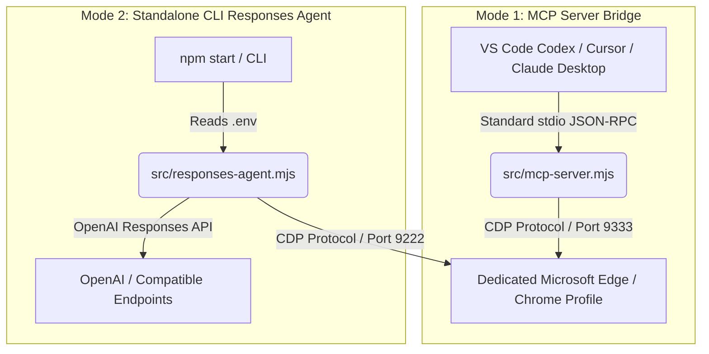

# Responses Edge Browser

[English](README_EN.md) | [简体中文](README.md)

[](https://nodejs.org/)
[](LICENSE)
[](https://modelcontextprotocol.io/)
[](https://playwright.dev/)
[](test)

**Responses Edge Browser** is a local browser automation and control bridge engineered specifically for AI Agents. By leveraging Playwright and the Chrome DevTools Protocol (CDP), it exposes native **Microsoft Edge** (and **Google Chrome**) capabilities to Large Language Models.

It functions both as a standard **stdio MCP (Model Context Protocol) server**—seamlessly integrating with clients like **VS Code Codex**, **Cursor**, **Claude Desktop**, **Antigravity**, and **Windsurf**—and as a standalone CLI agent powered by the **OpenAI Responses API** (or any compatible third-party inference provider implementing function calling).

---

## Table of Contents

- [Key Highlights](#key-highlights)
- [Architecture & Operating Modes](#architecture--operating-modes)
  - [Mode 1: Stdio MCP Server (Recommended for Agent IDEs)](#mode-1-stdio-mcp-server-recommended-for-agent-ides)
  - [Mode 2: Standalone Responses API Agent CLI (Autonomous Terminal Agent)](#mode-2-standalone-responses-api-agent-cli-autonomous-terminal-agent)
- [Quick Start](#quick-start)
  - [Prerequisites](#prerequisites)
  - [Installation](#installation)
- [MCP Client Integration](#mcp-client-integration)
  - [VS Code Codex](#vs-code-codex)
  - [Codex Managed via CC Switch](#codex-managed-via-cc-switch)
  - [Cursor](#cursor)
  - [Claude Desktop / Windsurf](#claude-desktop--windsurf)
- [Complete Toolset (21 Specialized Tools)](#complete-toolset-21-specialized-tools)
  - [1. Navigation & Page Perception](#1-navigation--page-perception)
  - [2. Element Interaction](#2-element-interaction)
  - [3. Multi-Tab Session Management](#3-multi-tab-session-management)
  - [4. Read-Only Diagnostics & Inspection](#4-read-only-diagnostics--inspection)
  - [5. Runtime Controls & Safety Handoff](#5-runtime-controls--safety-handoff)
- [Deep Dive into Core Mechanisms](#deep-dive-into-core-mechanisms)
  - [Dynamic Runtime Control (`browser_runtime`)](#dynamic-runtime-control-browser_runtime)
  - [Profile Isolation & Multi-Client Lease Locking](#profile-isolation--multi-client-lease-locking)
  - [Zero-Credential-Leak Security Architecture](#zero-credential-leak-security-architecture)
  - [Human-in-the-Loop Verification (`browser_handoff`)](#human-in-the-loop-verification-browser_handoff)
  - [Site Access Approval Policy (`browser_site`)](#site-access-approval-policy-browser_site)
- [Configuration Reference (.env and .env.mcp)](#configuration-reference-env-and-envmcp)
- [Diagnostics, Testing & Troubleshooting](#diagnostics-testing--troubleshooting)
  - [Test Suite (`npm test`)](#test-suite-npm-test)
  - [Doctor Diagnostics](#doctor-diagnostics)
  - [Safely Stopping Managed Browsers](#safely-stopping-managed-browsers)
- [Troubleshooting & FAQ](#troubleshooting--faq)
- [License](#license)

---

## Key Highlights

- **Dual-Engine Flexibility**: Native first-class support for Microsoft Edge, with immediate support for Google Chrome. Switch between engines on the fly via tools without altering configuration files.
- **21 Granular Tools**: Comprehensive toolset covering semantic DOM snapshots, click, typing, key combinations, scrolling, hover, double-click, file uploads, pre-armed native dialogs, multi-tab lifecycle management, screenshots, and read-only console/network diagnostics.
- **Multi-Client Isolation & Lease Locking**: When multiple concurrent Codex tasks or agent processes access the browser, each client operates exclusively on its own owned tabs. A file-based profile lock and client activity lease guarantee safe concurrency without colliding or prematurely closing shared instances.
- **Zero-Credential-Leak Security**:
  - Never leaks cookies, local storage, session storage, cleartext passwords, or sensitive request bodies to the model.
  - Sensitive URL query parameters (e.g., `token`, `password`, `key`) are automatically redacted.
  - Strictly disallows `file:`, `data:`, and `javascript:` pseudo-protocols. CDP debugging is strictly bound to the loopback interface (`127.0.0.1`).
- **Human-in-the-Loop Handoff**: When detecting Cloudflare Turnstile, CAPTCHA challenges, or multi-factor authentication (2FA), the agent halts automated retries and calls `browser_handoff pause`, prompting the user to solve the challenge in the visible window before resuming smoothly.
- **Decoupled Configuration**: MCP mode requires zero API keys (only reads `.env.mcp` for browser options), delegating intelligence to the host IDE. The standalone CLI mode independently manages credentials via `.env`.
- **Exhaustive Testing & Diagnostics**: Includes 58 automated unit/integration tests and dedicated doctor scripts to verify CDP communication, API provider compatibility, and MCP concurrency.

---

## Architecture & Operating Modes

This project offers two complementary operating modes:



### Mode 1: Stdio MCP Server (Recommended for Agent IDEs)

- **How It Works**: Spawns as a child process of your agent IDE (Codex, Cursor, etc.), communicating over standard I/O (stdio) via the Model Context Protocol.
- **Credentials**: **No `OPENAI_API_KEY` required**. The host IDE handles model inference and prompt execution; the MCP server exclusively manages local browser automation.
- **Configuration**: Exclusively reads `.env.mcp` for browser settings, ignoring any `.env` API keys.
- **Port & Profile**: Defaults to `http://127.0.0.1:9333` and an isolated project directory `.mcp-edge-profile`, protecting your daily personal browsing history and cookies.

### Mode 2: Standalone Responses API Agent CLI (Autonomous Terminal Agent)

- **How It Works**: Runs an autonomous agent execution loop directly from your command line.
- **Credentials**: Requires `OPENAI_API_KEY`, `OPENAI_BASE_URL`, and `OPENAI_MODEL` defined in `.env`.
- **Compatibility**: Supports official OpenAI endpoints as well as compatible third-party providers. Supports `RESPONSES_STATE_MODE=manual` (resending message history) and `RESPONSES_COMPAT_MODE=minimal` to handle stricter or partial Responses implementations.
- **Port & Profile**: Defaults to `http://127.0.0.1:9222` with profile storage located in `%LOCALAPPDATA%\ResponsesEdgeProfile`.

---

## Quick Start

### Prerequisites

1. **Operating System**: Windows 10/11 (optimal for Microsoft Edge), or macOS / Linux with Edge or Chrome installed.
2. **Node.js**: Version `20.0.0` or higher.
3. **Browser**: Microsoft Edge or Google Chrome.

### Installation

1. Clone the repository and install dependencies:
   ```powershell
   git clone https://github.com/OwlCt/browser-skill.git
   cd browser-skill
   npm install
   ```

2. Run the test suite to verify your setup:
   ```powershell
   npm test
   ```
   All 58 tests should pass (`pass 58, fail 0`).

3. Configure your environment:
   - **For MCP Mode (e.g., with VS Code Codex or Cursor)**:
     Review `.env.mcp` in the project root. The defaults work out-of-the-box (pointing to `.mcp-edge-profile` on port `9333`).
   - **For CLI Mode (standalone agent tasks)**:
     ```powershell
     Copy-Item .env.example .env
     ```
     Edit `.env` and fill in your model provider credentials:
     ```dotenv
     OPENAI_API_KEY=sk-xxxxxx
     OPENAI_BASE_URL=https://api.openai.com/v1
     OPENAI_MODEL=gpt-5.6
     ```
     Verify your endpoint compatibility:
     ```powershell
     npm run doctor:api
     ```

---

## MCP Client Integration

### VS Code Codex

This project includes an automated PowerShell script to register and manage the server in Codex CLI:

1. **Register the MCP Server**:
   ```powershell
   npm run mcp:install
   ```

2. **Verify Registration**:
   ```powershell
   npm run mcp:status
   ```
   Confirm that `responses_edge_browser` is listed with status `enabled`.

3. **Restart VS Code / Codex completely**, then prompt the agent:
   > "Use responses_edge_browser to open https://example.com and read the page title."

   Codex maps server tools with the prefix `mcp__responses_edge_browser__browser_*`.

> [!NOTE]
> Windows Workspace Sandbox note: When running inside certain offline workspace sandboxes, the command might execute under `CodexSandboxOffline` while `USERPROFILE` shows your desktop account. The installer detects this discrepancy. Run `mcp:install` directly from your desktop host terminal if this occurs.

### Codex Managed via CC Switch

If you use **CC Switch** to manage provider profiles for Codex, retain `responses_edge_browser` in CC Switch's common configuration and unified MCP registry so it does not get overwritten:

```toml
[mcp_servers.responses_edge_browser]
command = 'C:\Program Files\nodejs\node.exe'
args = ['C:\vscode\browser-skill\src\mcp-server.mjs']
cwd = 'C:\vscode\browser-skill'
enabled = true
startup_timeout_sec = 30
tool_timeout_sec = 120
```

### Cursor

Add the server in Cursor under `Settings -> Features -> MCP`, or edit your project/global `.cursor/mcp.json`:

```json
{
  "mcpServers": {
    "responses_edge_browser": {
      "command": "node",
      "args": ["C:/vscode/browser-skill/src/mcp-server.mjs"],
      "cwd": "C:/vscode/browser-skill"
    }
  }
}
```

### Claude Desktop / Windsurf

Add the server definition inside the `mcpServers` object in `claude_desktop_config.json`:

```json
{
  "mcpServers": {
    "responses_edge_browser": {
      "command": "node",
      "args": ["C:/vscode/browser-skill/src/mcp-server.mjs"],
      "cwd": "C:/vscode/browser-skill"
    }
  }
}
```

---

## Complete Toolset (21 Specialized Tools)

Every tool features strict JSON Schema parameter validation and atomic execution.

### 1. Navigation & Page Perception

| Tool Name | Parameters | Description |
| :--- | :--- | :--- |
| `browser_navigate` | `url` (string, required) | Navigates the active tab to an absolute HTTP(S) URL and returns the updated page snapshot. |
| `browser_snapshot` | None | Returns a semantic snapshot containing the active page URL, title, visible text, scroll status, and numbered element refs (e.g. `e1`, `e2`, and iframe refs like `f1e2`). |
| `browser_history` | `action`: `"back"` \| `"reload"` | Navigates backward in browser history or reloads the active page. |
| `browser_wait` | `milliseconds` (0~30000)<br>`text` (string)<br>`url` (string)<br>`load_state`: `"none"` \| `"domcontentloaded"` \| `"load"` \| `"networkidle"` | Waits for a condition (text appearance, URL substring, or network state) up to a timeout before returning the new state. |
| `browser_screenshot` | `full_page` (boolean, required) | Captures a viewport or full-page screenshot. Saved under `artifacts/`, or returned inline as a multimodal image if `BROWSER_INLINE_SCREENSHOTS=true`. |

### 2. Element Interaction

| Tool Name | Parameters | Description |
| :--- | :--- | :--- |
| `browser_click` | `ref` (string, required) | Clicks an interactive element identified in the snapshot (e.g., `e3` or `f1e2`). |
| `browser_type` | `ref` (string)<br>`text` (string)<br>`submit` (boolean) | Fills text into an editable element. **Password fields are strictly blocked**. Optionally presses Enter upon completion. |
| `browser_press` | `ref` (string)<br>`key` (string) | Presses a keyboard key or key combination (e.g., `Enter`, `Escape`, `ArrowDown`, `Control+A`). |
| `browser_select` | `ref` (string)<br>`value` (string) | Selects a `<select>` dropdown option by its option `value`. |
| `browser_scroll` | `direction`: `"up"` \| `"down"`<br>`amount` (50~3000) | Scrolls the active page vertically by the specified number of pixels. |
| `browser_hover` | `ref` (string, required) | Hovers over an element to reveal hover states, dropdown menus, or tooltips. |
| `browser_double_click` | `ref` (string, required) | Double-clicks an element from the snapshot. |
| `browser_file` | `ref` (string)<br>`path` (string) | Sets a local file path onto an `<input type="file">`. Accepts absolute paths or project-relative paths. Uploaded file bytes are never returned to the model. |
| `browser_dialog` | `action`: `"status"` \| `"arm"`<br>`decision`: `"keep"` \| `"accept"` \| `"dismiss"`<br>`prompt_text` (string) | Arms an automatic response for the next native `alert`, `confirm`, or `prompt`. **Unarmed dialogs are dismissed automatically** to avoid freezing page execution. |

### 3. Multi-Tab Session Management

| Tool Name | Parameters | Description |
| :--- | :--- | :--- |
| `browser_tabs` | `action`: `"list"` \| `"new"` \| `"switch"` \| `"close"`<br>`tab_id` (string)<br>`url` (string) | Lists, opens, switches to, or closes tabs owned by this MCP session. |

- **Session Tab Ownership**: Each MCP client can only view and manipulate tabs it explicitly opened.
- **Automatic Popup Reclamation**: Popups opened via implicit triggers (`window.open`) are automatically closed, keeping only the most recent popup. Only tabs created via `browser_tabs new` persist.
- **Idle Tab Cleanup**: Controlled by `EDGE_TAB_IDLE_TIMEOUT_MS`. When an MCP client disconnects, all tabs owned by that client are cleanly closed without affecting concurrent clients.

### 4. Read-Only Diagnostics & Inspection

Built specifically for debugging without compromising security or executing untrusted code:

| Tool Name | Parameters | Description |
| :--- | :--- | :--- |
| `browser_console` | `action`: `"list"` \| `"clear"`<br>`level`: `"all"` \| `"error"` \| `"warning"` \| `"info"` \| `"log"` | Retrieves recent console logs and unhandled page exceptions. **Does not execute any arbitrary script**. |
| `browser_network` | `action`: `"list"` \| `"clear"`<br>`limit` (1~100) | Inspects recent network request metadata (HTTP method, URL, resource type, status code). **Request/response bodies, cookies, and headers are strictly stripped**. |
| `browser_styles` | `ref` (string, required) | Reads a curated set of computed styles (display, position, color, margins) and bounding box geometry for an element. |

### 5. Runtime Controls & Safety Handoff

| Tool Name | Parameters | Description |
| :--- | :--- | :--- |
| `browser_runtime` | Multiple fields (see details below) | Dynamically inspects or reconfigures browser launch parameters (Edge/Chrome, headless/headed, window dimensions, extensions, profile target) without restarting the MCP service. |
| `browser_site` | `action`: `"status"` \| `"decide"`<br>`origin` (string)<br>`decision`: `"keep"` \| `"allow_once"` \| `"allow"` \| `"block"` | Approves or blocks website origins when `BROWSER_SITE_POLICY=ask` is active (session-only, permanently allowed, or blocked). |
| `browser_handoff` | `action`: `"status"` \| `"pause"` \| `"resume"` | Pauses automated actions when human verification (CAPTCHA, Turnstile, 2FA, login) is detected, handing control over to the user in the visible window, then resuming upon completion. |

---

## Deep Dive into Core Mechanisms

### Dynamic Runtime Control (`browser_runtime`)

When interacting with tasks requiring specific screen resolutions, extensions, or browser backends, `browser_runtime` allows immediate adjustments:

- **Preserving Unchanged Settings**: Pass `"keep"` for any argument that should remain unchanged.
- **Persistent State**: Applied changes are persisted to `.runtime/browser.json` and reused across subsequent managed launches.
- **Tunable Properties**:
  - `browser`: `"edge"` or `"chrome"`.
  - `headless`: `"true"` or `"false"`. If a browser is already running, it safely restarts when no other client operations are active.
  - `load_extensions`: Whether to omit `--disable-extensions`.
  - `stealth`: Experimental anti-automation flag omitting `--enable-automation` (does not spoof Canvas/WebGL or guarantee bypassing high-risk Cloudflare blocks).
  - `connection_mode`: `"managed"` (launched and supervised by the server) or `"attach"` (connects to an existing CDP instance without managing its lifecycle).
  - `profile_target`: `"dedicated"` (default isolated profile), `"user"` (default system browser profile), or `"custom"`. Switching to non-dedicated profiles requires `confirm_external_profile: "true"`.
  - `window`: Fixed window dimensions like `"1280x720"`, or `"default"`.
  - `bring_to_front`: Whether navigation actions activate and raise the window to the foreground.

### Profile Isolation & Multi-Client Lease Locking

Engineered for production resilience and multi-agent concurrency (`src/edge-lifecycle.mjs`):

1. **Dedicated Profile**: Defaults to `.mcp-edge-profile`. Cold starts clear orphaned session tabs while preserving cookies, login sessions, and cache.
2. **File Lock Mechanism**: A profile-level mutual exclusion lock prevents concurrent MCP server instances from colliding on the same directory or port.
3. **Client Leases**: Every connected MCP client holds a timestamped activity lease.
4. **Coordinated Shutdown**: Only when `EDGE_KEEP_OPEN=false` and the **very last active client disconnects** will the managed browser terminate. Unmanaged (attached) instances are never closed.

### Zero-Credential-Leak Security Architecture

Guarding against prompt injection and sensitive data exfiltration:

- **No Credential Exfiltration**: Tools do not expose commands to read cookies, `localStorage`, or `sessionStorage`.
- **Password Input Blocking**: `browser_type` detects `input[type="password"]` and refuses to type into it.
- **URL Parameter Scrubbing**: Any navigation query parameter matching keywords like `token`, `secret`, `password`, or `key` is masked as `[redacted]` before reaching the model.
- **Strict Protocol Filtering**: Forbids `file:`, `data:`, and `javascript:` URLs. CDP defaults exclusively to the loopback interface (`127.0.0.1`).

### Human-in-the-Loop Verification (`browser_handoff`)

Automated agents often hit CAPTCHA challenges or login checkpoints:

1. The snapshot evaluator flags Cloudflare Turnstile, reCAPTCHA, hCaptcha, or login forms automatically.
2. The agent halts blind retries and calls `browser_handoff pause`, prompting the user in chat.
3. The user solves the challenge or scans the QR code in the visible browser window.
4. The user notifies the agent, which invokes `browser_handoff resume` to verify completion and resume the workflow.

### Site Access Approval Policy (`browser_site`)

When `BROWSER_SITE_POLICY=ask` is configured (default):
- Loopback addresses (`localhost`, `127.0.0.1`) and domains explicitly listed in `BROWSER_ALLOWED_ORIGINS` are permitted immediately.
- Attempting navigation to any unapproved external origin halts with an authorization requirement.
- The agent presents the target domain to the user, who chooses an action via `browser_site`:
  - `allow_once`: Valid only for the active MCP session.
  - `allow`: Persisted to `.runtime/site-policy.json` for all future sessions.
  - `block`: Persisted block list; subsequent navigation attempts are immediately rejected.

To disable domain prompts entirely, set `BROWSER_SITE_POLICY=allow` in `.env.mcp`.

---

## Configuration Reference (.env and .env.mcp)

| Variable | Scope | Default | Description |
| :--- | :--- | :--- | :--- |
| `OPENAI_API_KEY` | CLI | Empty | Model provider API key (unused in MCP mode). |
| `OPENAI_BASE_URL` | CLI | `https://api.openai.com/v1` | Base URL for the Responses API endpoint. |
| `OPENAI_MODEL` | CLI | `gpt-5.6` | Target model identifier. |
| `RESPONSES_STATE_MODE` | CLI | `manual` | Responses state format: `manual` resends message history; `previous` uses `previous_response_id`. |
| `RESPONSES_COMPAT_MODE` | CLI | `standard` | Protocol level: `standard` sends all fields; `minimal` strips `store` / `strict` for non-standard endpoints. |
| `BROWSER_PRODUCT` | Both | `edge` | Target browser engine: `edge` or `chrome`. |
| `EDGE_CDP_URL` | Both | `http://127.0.0.1:9333` (MCP)<br>`http://127.0.0.1:9222` (CLI) | CDP endpoint URL. Strictly restricted to loopback unless remote is allowed. |
| `EDGE_USER_DATA_DIR` | Both | `.mcp-edge-profile` | User data profile directory path. |
| `EDGE_HEADLESS` | Both | `false` | Headless mode toggle. `false` spawns a visible window for manual inspection/handoff; `true` runs silently in background. |
| `EDGE_BRING_TO_FRONT` | Both | `true` | Whether actions bring the window/tab to the foreground. |
| `EDGE_KEEP_OPEN` | Both | `true` | Keeps browser process running between turns to avoid cold start delays. |
| `EDGE_AUTO_CLOSE_TABS` | Both | `true` (MCP) | Automatically closes orphaned popups while keeping explicitly opened tabs. |
| `EDGE_CLEAR_SESSION_TABS_ON_START` | Both | `true` (MCP) | Clears previously opened tabs on cold start while preserving cookies and logins. |
| `EDGE_TAB_IDLE_TIMEOUT_MS` | Both | `0` | Inactivity timeout in ms before closing owned tabs (`0` disables timeout). |
| `BROWSER_SITE_POLICY` | Both | `ask` | Site policy: `ask` (prompts before navigating to new origins) or `allow` (unrestricted). |
| `BROWSER_ALLOWED_ORIGINS` | Both | Empty | Comma-separated pre-approved origins (e.g. `https://example.com,http://localhost:3000`). |
| `BROWSER_INLINE_SCREENSHOTS` | Both | `true` (MCP)<br>`false` (CLI) | Returns base64 multimodal image payloads directly in tool outputs. |
| `BROWSER_ARTIFACTS_DIR` | Both | `artifacts` | Storage directory for captured screenshots and downloaded files. |

---

## Diagnostics, Testing & Troubleshooting

### Test Suite (`npm test`)

Runs 58 comprehensive unit and integration tests verifying tool functions, profile locking, lease coordination, and site policies:

```powershell
npm test
```

### Doctor Diagnostics

1. **Local Browser & CDP Doctor**:
   ```powershell
   npm run doctor
   ```
   Validates browser executable discovery, loopback CDP communication, and performs a round-trip DOM snapshot, typing, and click test.

2. **Responses API Provider Doctor**:
   ```powershell
   npm run doctor:api
   ```
   Sends a live test request to your configured `OPENAI_BASE_URL` to verify function-calling compatibility.

3. **Live MCP Server Doctor**:
   ```powershell
   npm run doctor:mcp
   ```
   Simulates concurrent MCP clients against the configured browser profile, asserting tab isolation, popup management, and screenshot creation.

4. **Isolated Sandbox MCP Doctor**:
   ```powershell
   npm run doctor:mcp -- --isolated
   ```
   Launches with a temporary directory and dynamic port to verify client disconnect cleanup without touching your active profiles.

### Safely Stopping Managed Browsers

To terminate any active MCP browser instance:

```powershell
npm run edge:mcp:stop
```

> [!CAUTION]
> Use this only when no other active Codex or agent sessions are running.

---

## Troubleshooting & FAQ

### Q1: Codex returns `Tool not found` or does not list browser tools?
1. Run `npm run mcp:status` and verify that `responses_edge_browser` is `enabled`.
2. Fully quit and restart VS Code (not just a window reload).
3. Confirm tool names in prompts match Codex's generated format, e.g., `mcp__responses_edge_browser__browser_navigate`.

### Q2: Why do I see `Site approval required for ...`?
This is the default security policy in action. Under `BROWSER_SITE_POLICY=ask`, visiting new external websites requires human consent via `browser_site`. Set `BROWSER_SITE_POLICY=allow` in `.env.mcp` to disable prompts.

### Q3: Why did navigation pause without interacting further?
Check your browser window. If Cloudflare Turnstile, a CAPTCHA, or a login form was detected, the agent paused execution (`browser_handoff pause`). Complete the verification manually in the browser, then instruct the agent to resume.

### Q4: How do I switch to Google Chrome?
Ask the agent in chat to call `browser_runtime` with `browser: "chrome"`, or set `BROWSER_PRODUCT=chrome` in `.env.mcp`. The system locates the local Chrome binary and uses a separate dedicated profile (`.mcp-chrome-profile`).

### Q5: How to resolve port conflicts (`EADDRINUSE`)?
Ensure no orphaned browser instances hold the debugging port. Run `npm run edge:mcp:stop` or terminate lingering `msedge.exe` / `chrome.exe` processes from Task Manager.

---

## License

This project is licensed under the [MIT License](LICENSE).
